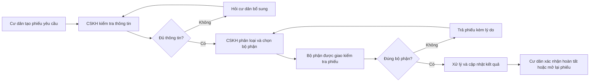
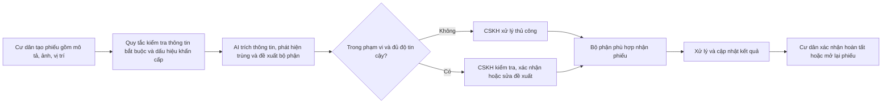
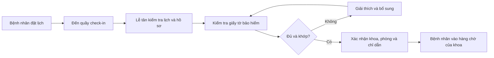
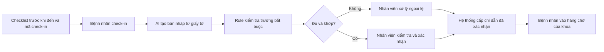
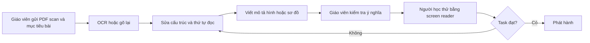
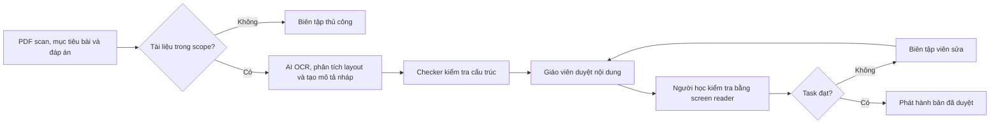

# 01 — Individual Problem Scan

> Điền theo Phase 1 + Phase 2 trong `01-worksheet.md`. Tự scan trước, dùng AI sau để phản biện. Không copy ví dụ Weekly Report.

## Thông tin cá nhân

- Họ và tên: Nguyễn Vũ Quang Anh
- Mã học viên: 2A202602805
- Vai trò / bối cảnh: BA Intern trong hệ sinh thái Vingroup, đồng thời là sinh viên năm cuối. Công việc tập trung vào research các vấn đề xã hội và bài toán vận hành thực tế, phân tích workflow, xác định bottleneck và đánh giá khả năng áp dụng AI/LLM/GenAI vào các dự án.
- Công việc hằng tuần:
  - Nghiên cứu các pain point xã hội và doanh nghiệp.
  - Tìm hiểu workflow hiện tại.
  - Đọc tài liệu, research paper, báo cáo và case study.
  - Xác định actor, bottleneck và metric.
  - Đánh giá AI có thực sự cần thiết hay Rule/Workflow thông thường đã đủ.

---

## Phase 1 — Scan 5+ problems (tối thiểu 5, khuyến khích 8-10)

**Cách điền:** mỗi dòng = việc gì + ai chịu + đo bằng gì. Cột `Dấu hiệu thật` bắt buộc có số: mất bao lâu (bấm giờ mấy lần), mấy lần/tuần, bao nhiêu người gặp, log/ticket/quote nào.

| # | Lăng kính (Lặp lại / Tốn thời gian / AI có thể tốt hơn / Pain từ người khác) | Problem quan sát được | Ai chịu ảnh hưởng? | Dấu hiệu thật (số + bằng chứng) |
|---|---|---|---|---|
| 1 | Tốn thời gian / AI có thể tốt hơn | Khi bệnh nhân ngoại trú có lịch hẹn và sử dụng bảo hiểm đến cơ sở khám, việc kiểm tra lịch, hồ sơ, giấy tờ và chỉ dẫn khu khám có thể phát sinh hỏi lại hoặc bổ sung thông tin. Scope: từ lúc bắt đầu check-in đến khi nhận chỉ dẫn hợp lệ, không gồm thời gian chờ bác sĩ. | Bệnh nhân/người nhà; lễ tân; nhân viên bảo hiểm; khoa/phòng khám | **Bối cảnh:** [WHO](https://www.who.int/vietnam/health-topics/hospitals) liệt kê thời gian chờ dài và trải nghiệm người bệnh trong các thách thức tại cơ sở y tế, nhưng không có số liệu riêng cho workflow này. **Cần kiểm chứng:** quan sát ít nhất 30 lượt check-in trong 2 khung giờ cao điểm; đo median/P90 thời gian hành chính, tỷ lệ thiếu giấy tờ và số lần hỏi lại. |
| 2 | Lặp lại / Pain từ người khác / Tốn thời gian | Khi cư dân gửi một yêu cầu dịch vụ không khẩn cấp bằng mô tả tự do, thông tin có thể thiếu hoặc phiếu yêu cầu có thể được chuyển qua nhiều bộ phận trước khi đúng đội nhận xử lý. | Cư dân; CSKH; ban quản lý/điều phối; đội kỹ thuật, vệ sinh hoặc cảnh quan | **Bối cảnh:** [Báo cáo thường niên Vinhomes 2024](https://gcp-cdn.vinhomes.vn/cms-data/VIE_Vinhomes%20AR%202024_250411_compressed.pdf) ghi nhận 228.000 tài khoản Vinhomes Resident hoạt động và hơn 86% căn hộ đã sử dụng ứng dụng vào 31/12/2024; [Vinhomes](https://vinhomes.vn/vi/ra-mat-tro-ly-ao-tren-ung-dung-vinhomes-resident-va-vinhomes-online) cũng công bố trợ lý ViVi trên ứng dụng. Các số này chỉ chứng minh có kênh số, chưa chứng minh vấn đề phân công sai. **Cần kiểm chứng:** tối thiểu 100 phiếu yêu cầu đã ẩn danh; đo tỷ lệ phiếu đến đúng bộ phận ngay lần đầu, thời gian từ lúc gửi đến lúc đúng bộ phận nhận, số lần chuyển lại, số vòng hỏi bổ sung và tỷ lệ mở lại. |
| 3 | Tốn thời gian / Pain từ người khác | Khi tự nộp một loại hồ sơ dịch vụ công trực tuyến, người dân có thể không hiểu giấy tờ nào phù hợp với trường hợp của mình, phải hỏi cán bộ hoặc bổ sung nhiều lần. Scope khảo sát: bước đọc hướng dẫn và chuẩn bị hồ sơ trước khi nộp, tại một địa bàn cụ thể. | Người nộp hồ sơ lần đầu, người ít kỹ năng số; cán bộ tiếp nhận và hỗ trợ | **Bối cảnh:** đánh giá của [UNDP/IPS năm 2024](https://www.undp.org/vietnam/press-releases/improving-online-public-administrative-service-delivery-digital-governance-mindset) cho thấy cả 63 cổng dịch vụ công cấp tỉnh được khảo sát đều có điểm bất tiện; người dùng vẫn phải dựa vào hướng dẫn trực tiếp. **Cần kiểm chứng:** quan sát 10 người chuẩn bị cùng một loại hồ sơ; đo phút chuẩn bị, số lần hỏi hỗ trợ và tỷ lệ checklist đúng theo cán bộ. |
| 4 | Lặp lại / Tốn thời gian / AI có thể tốt hơn | Sau mỗi bài kiểm tra, giáo viên phải đọc bài, tìm lỗi kiến thức của từng học sinh và chọn bài luyện phù hợp; nếu chỉ trả điểm chung thì học sinh chưa biết mình sai ở đâu. Scope: một lớp, một môn và một chủ đề kiến thức. | Giáo viên; học sinh cần củng cố kiến thức; phụ huynh | **Bối cảnh:** [UNICEF Việt Nam](https://www.unicef.org/vietnam/skills-and-learning-all) nêu khoảng cách tiếp cận học tập số và nhu cầu cải thiện phương pháp dạy, học, đánh giá. **Cần kiểm chứng:** hỏi 3 giáo viên và xem 30 bài đã ẩn danh; đo phút phản hồi/bài, tỷ lệ xác định đúng lỗi theo giáo viên và kết quả bài kiểm tra lại cùng kỹ năng. |
| 5 | Tốn thời gian / Pain từ người khác / AI có thể tốt hơn | Học sinh khiếm thị gặp khó khi tài liệu học là bản scan, ảnh hoặc sơ đồ không có mô tả; giáo viên/người hỗ trợ phải chuyển nội dung thành văn bản và lời mô tả trước khi học sinh sử dụng được. Scope: chuyển một loại phiếu bài tập thành định dạng tương thích trình đọc màn hình. | Học sinh khiếm thị; giáo viên giáo dục hòa nhập; người hỗ trợ học tập | **Bối cảnh:** [UNICEF Việt Nam](https://www.unicef.org/vietnam/skills-and-learning-all) nhấn mạnh nhu cầu công cụ giáo dục hòa nhập và công nghệ hỗ trợ. **Cần kiểm chứng:** thử 20 trang tài liệu với 3–5 người dùng phù hợp; đo phút chuyển đổi/trang, lỗi làm sai nghĩa và tỷ lệ hoàn thành bài với trình đọc màn hình. |
| 6 | Lặp lại / Pain từ người khác | Khi nhiều thành viên gia đình cùng chăm sóc người cao tuổi tại nhà, thông tin về lịch hẹn, sinh hoạt và việc cần hỗ trợ có thể nằm rải rác trong cuộc gọi/tin nhắn; người nhận ca phải hỏi lại hoặc bỏ sót việc đã thống nhất. Scope: bàn giao thông tin chăm sóc hằng ngày. | Người cao tuổi cần hỗ trợ; con cháu; người chăm sóc tại nhà; điều phối viên dịch vụ chăm sóc | **Bối cảnh:** [nghiên cứu UNFPA về kinh tế chăm sóc](https://vietnam.unfpa.org/sites/default/files/pub-pdf/2025-12/Applying%20foresight%20to%20curate%20a%20care%20economy%20for%20OP%20in%20VN_EN_FINAL.pdf) ước tính số người cao tuổi cần hỗ trợ hoạt động hằng ngày tăng từ 4,7 triệu năm 2025 lên khoảng 6,5 triệu năm 2035. **Cần kiểm chứng:** phỏng vấn 5 hộ có nhiều người cùng chăm sóc; ghi nhật ký 7 ngày, đo số lần hỏi lại, việc bị bỏ sót và phút tổng hợp thông tin/ngày. |
| 7 | Pain từ người khác / Tốn thời gian / AI có thể tốt hơn | Khi mưa lớn, điều phối viên vận tải phải ghép thông tin ngập từ nhiều phản ánh để biết đoạn đường nào cần xác minh và điều chỉnh chuyến; thông tin thiếu thời điểm hoặc vị trí khiến quyết định chậm. Scope: xác minh tình trạng ngập trên một hành lang vận tải. | Người đi làm; tài xế; hành khách; điều phối viên đội xe; đơn vị quản lý đường và thoát nước | **Bối cảnh:** [World Bank, tháng 1/2026](https://www.worldbank.org/en/results/2026/01/26/strengthening-flood-resilience-in-rapidly-growing-cities) mô tả hệ thống chống ngập Cần Thơ bảo vệ hơn 422.000 người và có 60 cảm biến tại các điểm ngập. **Cần kiểm chứng:** đối chiếu 30 phản ánh có thời gian/vị trí với xác nhận thực địa; đo độ trễ xác minh, tỷ lệ báo sai và số chuyến bị ảnh hưởng. |
| 8 | Lặp lại / Pain từ người khác / AI có thể tốt hơn | Khi bỏ rác bao bì, người dân có thể không biết vật đó thuộc nhóm nào hoặc cần làm sạch/tách bộ phận ra sao theo cách thu gom tại nơi ở; phân loại nhầm có thể làm tăng công phân loại lại. Scope: các loại bao bì phổ biến tại một cụm dân cư. | Hộ gia đình; nhân viên vệ sinh; đơn vị thu gom và tái chế | **Bối cảnh:** [World Bank — chẩn đoán ô nhiễm nhựa Việt Nam](https://www.worldbank.org/en/country/vietnam/publication/towards-a-national-single-use-plastics-roadmap-in-vietnam-strategies-and-options-for-reducing-priority-single-use-plasti) ước tính 3,1 triệu tấn chất thải nhựa được thải trên đất liền mỗi năm. **Cần kiểm chứng:** khảo sát 20 hộ và đơn vị thu gom; kiểm tra 100 vật phẩm, đo tỷ lệ phân loại sai và phút phân loại lại. |
| 9 | Lặp lại / AI có thể tốt hơn / Pain từ người khác | Người quản lý đội xe khó xem lại toàn bộ video hành trình để phát hiện các tình huống suýt va chạm và đưa phản hồi cụ thể cho tài xế. Scope: phát hiện một loại sự kiện trên một tuyến để người phụ trách review. | Tài xế; hành khách; người đi đường; quản lý an toàn đội xe | **Bối cảnh:** [WHO — hồ sơ an toàn đường bộ Việt Nam 2023](https://www.who.int/publications/m/item/road-safety-vnm-2023-country-profile) ước tính 17.229 người tử vong do giao thông đường bộ năm 2021. **Cần kiểm chứng:** gán nhãn 100 đoạn video gồm tình huống thường và nguy hiểm; đo tỷ lệ phát hiện đúng, bỏ sót, cảnh báo nhầm và phút review/giờ video. |
| 10 | Pain từ người khác / AI có thể tốt hơn | Khi nhận tin nhắn hoặc ảnh chụp yêu cầu chuyển tiền/cài ứng dụng, người dùng khó phân biệt nội dung hợp lệ với mạo danh và không biết kiểm tra qua kênh nào trước khi hành động. Scope: hỗ trợ kiểm tra một nhóm tin nhắn mạo danh dịch vụ. | Người dùng điện thoại; người ít kinh nghiệm số; người thân hỗ trợ; CSKH của tổ chức bị mạo danh | **Bối cảnh:** [Báo Chính phủ, 16/12/2024](https://baochinhphu.vn/thiet-hai-do-lua-dao-truc-tuyen-uoc-tinh-18900-ty-dong-nam-2024-102241216153209577.htm) dẫn khảo sát của Hiệp hội An ninh mạng quốc gia, ước tính thiệt hại lừa đảo trực tuyến năm 2024 là 18.900 tỷ đồng. **Cần kiểm chứng:** xây bộ 100 tin nhắn đã ẩn danh và được xác minh, gồm hợp lệ và lừa đảo; đo bỏ sót, cảnh báo nhầm và khả năng người dùng chọn đúng bước xác minh. |

> Gợi ý tự soi: tuần trước mất nhiều thời gian nhất vào việc gì? Việc gì hay trì hoãn? Người khác hay hỏi lại câu gì? Workflow nào ai cũng biết là chậm?

**AI đã dùng ở Phase 1 (nếu có):**

- Prompt đã hỏi: Đóng vai trò là một BA của tập đoàn Vingroup tìm kiếm các số liệu và các nguồn về bottleneck và các vấn đề xã hội đang tồn đọng ở trong tập đoàn cũng như Việt Nam.
- Ý dùng được: Các ý được đưa vào scan là các vấn đề tại các cơ sở và những vấn đề phổ biến trong xã hội.
- Ý bỏ vì không phải pain thật: Các ý như vấn đề hết pin ở VinFast về các trạm sạc hay tài xế XanhSM vì việc chuẩn bị trước có thể đã giải quyết phần lớn vấn đề.

**Self-check Phase 1:**

- [x] Đủ 5+ dòng, mỗi dòng có actor + số đo cụ thể
- [x] Dùng ít nhất 3/4 lăng kính
- [x] Không có dòng chung chung kiểu "mất nhiều thời gian"

---

## Phase 2 — Top 3 Problem Cards

### 2.1. Chọn top 3

| Rank | Problem (copy từ bảng scan) | Vì sao chọn (2-3 ý) | Điều còn chưa chắc |
|---:|---|---|---|
| 1 | Yêu cầu dịch vụ không khẩn cấp của cư dân bị thiếu thông tin hoặc chuyển sai bộ phận trước khi được xử lý. | Tác nhân và các bước bàn giao rõ; lịch sử phiếu yêu cầu có thể dùng để đo hiện trạng; có thể so sánh biểu mẫu/quy tắc với workflow có AI. Giải pháp có thể áp dụng cho nhiều khu đô thị hoặc chung cư. | Chưa có lịch sử xử lý để xác nhận tỷ lệ hỏi lại hoặc chuyển sai; chưa biết nguyên nhân đến từ mô tả thiếu, danh mục phân loại, phân quyền hay năng lực xử lý. |
| 2 | Bệnh nhân ngoại trú có lịch hẹn và dùng bảo hiểm mất thời gian ở bước kiểm tra lịch, hồ sơ, giấy tờ và tìm khu khám. | Workflow hành chính rõ và có thể đo tách khỏi thời gian khám; có thể so sánh checklist/rule với AI trích xuất thông tin. | Chưa có baseline; chưa biết check-in có phải bottleneck chính và quyền truy cập dữ liệu cho phép đến đâu. |
| 3 | Học liệu dạng scan, ảnh và sơ đồ chưa có cấu trúc hoặc mô tả phù hợp cho trình đọc màn hình. | Có đầu vào, đầu ra và người kiểm tra rõ; tác động xã hội có thể đo qua thời gian chuyển đổi, lỗi nội dung và khả năng hoàn thành task. | Chưa xác nhận nhu cầu trên một loại tài liệu cụ thể; độ chính xác với bảng, công thức và sơ đồ; chi phí review. |

### 2.2. Problem Cards chi tiết

---

#### Problem Card #1 — Hoàn thiện thông tin và chuyển yêu cầu cư dân đến đúng bộ phận

```text
Problem 1 câu:
Khi cư dân gửi yêu cầu dịch vụ không khẩn cấp bằng mô tả tự do, thông tin về vị trí, thiết bị, hình ảnh hoặc mức độ ảnh hưởng có thể thiếu; bộ phận tiếp nhận phải hỏi lại và phiếu yêu cầu có thể qua nhiều đội trước khi đúng người nhận xử lý.

Giải thích "phiếu yêu cầu":
Phiếu yêu cầu là bản ghi của một vấn đề trên hệ thống. Mỗi phiếu có mã riêng và lưu người gửi, thời gian gửi, khu vực/căn hộ, nội dung, hình ảnh, mức ưu tiên, bộ phận phụ trách, trạng thái và toàn bộ lịch sử trao đổi/xử lý.

Actor:
Cư dân phát hiện và gửi vấn đề; nhân viên CSKH tiếp nhận và kiểm tra; ban quản lý/điều phối xác nhận bộ phận phụ trách; đội kỹ thuật, vệ sinh hoặc cảnh quan nhận và xử lý; cư dân kiểm tra kết quả.

Thời điểm / bối cảnh:
Khi cư dân phát hiện vấn đề không khẩn cấp tại một khu đô thị/chung cư, ví dụ đèn hành lang hỏng, khu vực chung chưa được vệ sinh hoặc cây xanh cần chăm sóc. Phạm vi thử nghiệm gồm 2-3 nhóm yêu cầu phổ biến; không gồm cháy nổ, y tế hoặc an ninh khẩn cấp.

Current workflow 3-7 bước:
1. Cư dân phát hiện vấn đề, mở ứng dụng/kênh hỗ trợ và tạo phiếu yêu cầu bằng mô tả, hình ảnh, vị trí nếu có.
2. Nhân viên CSKH đọc phiếu, kiểm tra xem thông tin đã đủ để xử lý chưa.
3. Nếu còn thiếu, CSKH liên hệ cư dân để hỏi thêm vị trí cụ thể, thiết bị liên quan, hình ảnh hoặc mức độ ảnh hưởng.
4. Khi đủ thông tin, CSKH chọn nhóm vấn đề, mức ưu tiên theo quy tắc và chuyển phiếu cho bộ phận dự kiến phụ trách.
5. Bộ phận nhận phiếu kiểm tra. Nếu nhận sai, họ trả phiếu về ban quản lý/CSKH kèm lý do để chuyển lại; nếu đúng, họ tiếp nhận xử lý.
6. Bộ phận phụ trách lên lịch, xử lý vấn đề và cập nhật trạng thái/kết quả trên hệ thống.
7. Cư dân nhận thông báo, kiểm tra kết quả và xác nhận hoàn tất hoặc yêu cầu mở lại phiếu.

Bottleneck:
Bước 2-5: thông tin ban đầu thiếu và cách phân loại/chọn bộ phận chưa nhất quán có thể tạo nhiều vòng hỏi lại hoặc chuyển phiếu sai. Cần xem lịch sử xử lý để phân biệt với các nguyên nhân khác như đội xử lý thiếu nhân lực, vật tư hoặc quyền phê duyệt.

Impact:
Làm tăng thời gian từ lúc cư dân gửi yêu cầu đến khi đúng bộ phận nhận xử lý, tăng công đọc/chuyển phiếu của CSKH và buộc cư dân giải thích lại. Thời gian sửa chữa tại hiện trường không được tính hoàn toàn là tác động của AI phân công.

Success metric:
Đo hiện trạng ban đầu (T0) trên ít nhất 100 phiếu yêu cầu đã ẩn danh, thuộc cùng 2-3 nhóm vấn đề và cùng khoảng thời gian vận hành.

1. Tỷ lệ chuyển đúng ngay lần đầu (%) = số phiếu được bộ phận xử lý cuối cùng tiếp nhận ngay lần đầu / tổng số phiếu hợp lệ × 100. Mục tiêu: tăng ít nhất 20 điểm phần trăm so với T0 hoặc giảm ít nhất 30% số phiếu chuyển sai.
2. Thời gian đến đúng bộ phận (phút) = thời điểm bộ phận xử lý cuối cùng tiếp nhận − thời điểm cư dân gửi phiếu. Dùng trung vị để hạn chế ảnh hưởng của các trường hợp quá lâu. Mục tiêu: giảm ít nhất 40% so với trung vị T0.
3. Tỷ lệ cần hỏi bổ sung (%) = số phiếu cần CSKH hỏi cư dân ít nhất một lần / tổng số phiếu × 100. Mục tiêu: giảm ít nhất 30% so với T0.
4. Tỷ lệ mở lại trong 7 ngày (%) = số phiếu bị cư dân mở lại trong 7 ngày sau khi đóng / tổng số phiếu đã đóng × 100. Đây là chỉ số kiểm soát chất lượng: không được cao hơn T0.
5. Tỷ lệ trường hợp khẩn cấp bị đưa vào luồng thường (%) = số trường hợp khẩn cấp bị phân loại vào luồng thường / tổng số trường hợp khẩn cấp × 100. Ngưỡng chấp nhận: 0%.

Pilot đạt khi đồng thời đạt mục tiêu 1 và 2, đồng thời các chỉ số 4 và 5 không vượt ngưỡng kiểm soát. Chỉ số 3 dùng để đánh giá thêm khả năng cải thiện chất lượng thông tin đầu vào.

Non-AI alternative:
Biểu mẫu thay đổi theo loại vấn đề; bắt buộc nhập vị trí/hình ảnh; mã QR tự điền vị trí; danh mục vấn đề ngắn gọn; bảng quy định bộ phận phụ trách có người quản lý; chuẩn hóa thời hạn xử lý và lý do trả phiếu.

AI hypothesis:
Sau khi quy tắc cố định kiểm tra trường bắt buộc và dấu hiệu khẩn cấp, AI đọc mô tả/hình ảnh để trích xuất vị trí, thiết bị và loại vấn đề; hỏi thông tin còn thiếu; phát hiện phiếu gần trùng; đề xuất nhóm vấn đề và bộ phận phụ trách kèm lý do. CSKH phải xác nhận trước khi chuyển; AI không tự đóng phiếu yêu cầu.

Quick gut:
[ ] No AI / process fix
[ ] Rule
[x] Workflow
[ ] Agent
[ ] Chưa biết
```

**Draft workflow Card #1:**
**Current — Quy trình hiện tại**

**Future — Quy trình sau cải tiến**


Fallback: AI có độ tin cậy thấp, vấn đề nằm ngoài danh mục, hình ảnh không đọc được hoặc có dấu hiệu khẩn cấp → chuyển ngay cho nhân viên phụ trách xử lý theo quy trình hiện tại.

---

File đính kèm (nếu vẽ riêng): `01-individual-problem-scan-workflow-card-1.png`

---

#### Problem Card #2 — Hỗ trợ tiếp nhận hành chính bệnh nhân ngoại trú

```text
Problem 1 câu:
Khi bệnh nhân ngoại trú có lịch hẹn và sử dụng bảo hiểm đến cơ sở khám, nhân viên phải kiểm tra lịch, hồ sơ, giấy tờ và chỉ dẫn khu khám; thông tin thiếu hoặc không khớp làm phát sinh hỏi lại và kéo dài thời gian hành chính trước khám.

Actor:
Bệnh nhân/người nhà; lễ tân/tiếp đón; nhân viên bảo hiểm; khoa/phòng khám; điều phối viên xử lý ngoại lệ.

Thời điểm / bối cảnh:
Khi bệnh nhân ngoại trú đã đặt lịch đến check-in trong giờ cao điểm. Scope kết thúc khi bệnh nhân nhận chỉ dẫn hợp lệ tới khu khám; không gồm cấp cứu, chẩn đoán, quyết định bảo hiểm hoặc thời gian chờ bác sĩ.

Current workflow 3-7 bước:
1. Bệnh nhân đặt lịch qua app, hotline hoặc quầy.
2. Bệnh nhân tới quầy và cung cấp mã lịch, định danh, giấy tờ bảo hiểm.
3. Lễ tân kiểm tra lịch và tìm/mở/cập nhật hồ sơ.
4. Nhân viên kiểm tra bộ giấy tờ và yêu cầu bổ sung nếu thiếu.
5. Lễ tân/khoa xác nhận địa điểm và chỉ dẫn bệnh nhân.
6. Bệnh nhân di chuyển và vào hàng chờ của khoa.

Bottleneck:
Bước 2-5: kiểm tra qua nhiều điểm và bổ sung thông tin có thể kéo dài thời gian hành chính. Cần tách queue time, service time, thời gian chờ bổ sung và thời gian chờ bác sĩ để xác nhận bottleneck.

Impact:
Tăng thời gian thao tác của nhân viên, thời gian hành chính trước khám, số vòng bổ sung và số lần bệnh nhân hỏi lại/đi nhầm khu khám.

Success metric:
Đo baseline T0 trước pilot. Mục tiêu: giảm ít nhất 30% median administrative lead time; giảm ít nhất 25% staff handling time sau khi tính cả review AI; giảm ít nhất 30% missing-document clarification rate; không tăng tỷ lệ sửa hồ sơ hoặc chỉ dẫn sai; nhân viên phê duyệt 100% case bảo hiểm.

Non-AI alternative:
Checklist gửi trước; form validation; QR check-in; biển chỉ dẫn/mã màu; tách quầy case chuẩn và ngoại lệ; dashboard hàng đợi.

AI hypothesis:
AI tạo bản nháp từ giấy tờ được phép dùng, phát hiện trường còn thiếu và trả lời chỉ dẫn dựa trên lịch/phòng đã được xác nhận. Rule kiểm tra trường bắt buộc; nhân viên quyết định tính hợp lệ. AI không chẩn đoán, phân luồng cấp cứu hoặc quyết định quyền lợi bảo hiểm.

Quick gut:
[ ] No AI / process fix
[ ] Rule
[x] Workflow
[x] Agent
[ ] Chưa biết
```

**Draft workflow Card #2:**
**Current**

**Future**


Fallback: giấy tờ không đọc được, dữ liệu mâu thuẫn, tích hợp lỗi hoặc case ngoài scope → nhân viên xử lý tại quầy theo quy trình hiện tại.

---

#### Problem Card #3 — Chuyển đổi học liệu cho người học khiếm thị

```text
Problem 1 câu:
Khi học liệu chỉ có dạng PDF scan, ảnh, bảng hoặc sơ đồ không có cấu trúc, giáo viên/người hỗ trợ phải OCR, sửa thứ tự đọc và viết mô tả thay thế trước khi người học khiếm thị có thể dùng trình đọc màn hình.

Actor:
Người học khiếm thị; giáo viên/người tạo học liệu; nhân viên hỗ trợ/biên tập accessible; giáo viên bộ môn; chuyên gia accessibility.

Thời điểm / bối cảnh:
Trước khi phát hành một loại phiếu bài tập của một môn. Pilot gồm văn bản, bảng đơn giản và hình minh họa; chưa gồm công thức, bản đồ hoặc sơ đồ phức tạp.

Current workflow 3-7 bước:
1. Giáo viên gửi PDF scan/ảnh và mục tiêu bài học.
2. Nhân viên OCR hoặc gõ lại nội dung.
3. Nhân viên sửa heading, bảng và thứ tự đọc.
4. Nhân viên/giáo viên viết mô tả cho hình hoặc sơ đồ.
5. Giáo viên bộ môn kiểm tra tính đúng nghĩa.
6. Người học thử bằng trình đọc màn hình; nhóm sửa rồi phát hành.

Bottleneck:
Bước 2-4 tốn công thủ công; lỗi OCR, reading order hoặc mô tả hình có thể làm sai nội dung. Lợi ích chỉ có khi thời gian AI tiết kiệm lớn hơn thời gian review và sửa.

Impact:
Tăng thời gian chuẩn bị mỗi trang/tài liệu, khiến học liệu đến người học muộn và có nguy cơ làm người học hiểu sai câu hỏi hoặc dữ kiện.

Success metric:
Thử với 20 tài liệu và người dùng phù hợp. Mục tiêu: giảm ít nhất 50% tổng thời gian chuyển đổi + review; không còn lỗi nghiêm trọng trước phát hành; ít nhất 90% task đọc/tìm thông tin hoàn thành được và không thấp hơn bản thủ công; usability trung bình ít nhất 4/5.

Non-AI alternative:
Soạn tài liệu mới bằng template accessible có heading, text layer, alt text và reading order; dùng checklist/checker; đào tạo người tạo học liệu.

AI hypothesis:
AI OCR và phân tích layout để tạo bản nháp có cấu trúc, đề xuất alt text/long description và đánh dấu vùng confidence thấp. Giáo viên duyệt nội dung; người học khiếm thị kiểm tra khả năng sử dụng. AI không tự phát hành tài liệu.

Quick gut:
[ ] No AI / process fix
[ ] Rule
[x] Workflow
[ ] Agent
[ ] Chưa biết
```

**Draft workflow Card #3:**
**Current**

**Future**


Fallback: tài liệu ngoài scope, AI confidence thấp, checker báo lỗi nghiêm trọng hoặc người dùng không hoàn thành task → chuyển sang biên tập thủ công.

File đính kèm: [current](mermaid_code/workflow-card-3-current.mmd), [future](mermaid_code/workflow-card-3-future.mmd)

---

### 2.3. Card muốn pitch nhất (chuẩn bị 2 phút)

**Card tôi muốn pitch nhất:**

```
Card tôi muốn pitch nhất là Card #1 vì bài toán gắn trực tiếp với trải nghiệm của cư dân và quy trình vận hành hằng ngày của khu đô thị. Nếu thử nghiệm hiệu quả, giải pháp có thể mở rộng cho các khu đô thị và chung cư khác ngoài hệ sinh thái Vingroup.
```

**Vì sao (2-3 câu: workflow gì, số đo gì, impact gì):**

```
Giải pháp sử dụng một workflow gồm quy tắc cố định, AI hỗ trợ đọc và cấu trúc thông tin, sau đó CSKH kiểm tra trước khi chuyển phiếu tới bộ phận phụ trách. Tác động kỳ vọng là giảm thời gian chờ đúng bộ phận tiếp nhận, giảm công đọc/chuyển phiếu của CSKH và giảm số lần cư dân phải giải thích lại. Kết quả được đo trên ít nhất 100 phiếu đã ẩn danh, với mục tiêu giảm 30% số phiếu chuyển sai, giảm 40% thời gian trung vị đến khi đúng bộ phận nhận và không làm tăng tỷ lệ mở lại.
```

**Câu hỏi tôi muốn nhóm challenge (1-2 câu hỏi đúng chỗ yếu):**

```text
1. Nhóm có bằng chứng nào cho thấy phiếu yêu cầu bị chậm chủ yếu vì cư dân cung cấp thiếu thông tin hoặc CSKH chuyển sai bộ phận, thay vì do đội xử lý thiếu nhân lực, vật tư hoặc chưa có thời hạn xử lý rõ ràng?
2. Nếu biểu mẫu động và các quy tắc phân công đã giải quyết được 70-80% trường hợp, phần còn lại có đặc điểm gì khiến AI thực sự cần thiết, và ai sẽ kiểm tra khi AI đề xuất sai?
```

**AI phản biện Card (nếu có):**

- Điểm yếu AI chỉ ra: Chưa có số liệu hiện trạng nội bộ; cần tách nguyên nhân AI hỗ trợ được khỏi vấn đề thiếu nhân lực, vật tư hoặc quyền quyết định.
- Tôi sửa gì: Thu hẹp phạm vi; mô tả tác nhân và các bước bàn giao; bổ sung chỉ số đo, phương án không dùng AI, bước kiểm tra của con người và phương án dự phòng.

### Self-check nộp phần 01

- [x] Có 5+ problems + top 3 Cards đủ field
- [x] Mỗi Card có workflow trước/sau + bottleneck + metric + fallback
- [x] Đã chọn 1 card pitch + câu hỏi challenge
