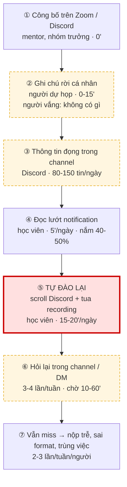
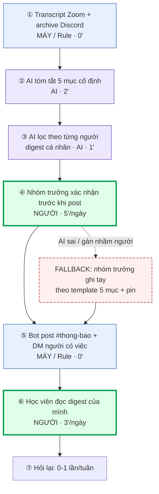

# 02 — Group Problem Statement (Bản nộp nhóm)

> Làm chung 1 bản, mỗi thành viên copy vào repo cá nhân. Đi theo Phase 3 → 6 trong `01-worksheet.md`. Nhóm chỉ chọn **candidate problem** ở Phase 3, viết Problem Statement sau khi validate + vẽ workflow.

## Thành viên nhóm

| STT | Họ và tên | Mã học viên | Vai trò trong nhóm |
|-----|-----------|-------------|--------------------|
| 1 | Nguyễn Thị Minh Khánh | 2A202602546 | Facilitator — điều phối vòng pitch, giữ giờ, chốt đồng thuận |
| 2 | Phạm Minh Hiếu | 2A202602919 | Workflow + writer — vẽ before/after (ASCII + Mermaid), viết Bottleneck, Success Metric, Boundary |
| 3 | Nguyễn Việt Hoàng Hải | 2A202602967 | **Problem owner** — người đưa ra candidate problem nhóm chọn; phụ trách phần đồng ý của người thật |
| 4 | Nguyễn Quang Huy | 2A202602421 | Research — tìm tool/pattern tương tự, kiểm chứng link nguồn |
| 5 | Nguyễn Khắc Giáp | 2A202602950 | Validation — phỏng vấn nhanh, chạy poll Discord, gom số liệu |

**Candidate problem nhóm chọn (1 câu):**

Học viên trong nhóm/lớp K4A bị **thất thoát thông tin liên quan trực tiếp đến cá nhân mình** — deadline, việc được phân công, thay đổi yêu cầu nộp bài — vì thông tin nằm rải rác giữa dòng chat Discord đông tin và các buổi Zoom 90-120 phút không có bản tóm tắt chính thức, khiến mỗi người phải tự đào lại 15-20 phút/ngày mà vẫn miss 2-3 lần/tuần.

> *Ý tưởng gốc: **Nguyễn Việt Hoàng Hải** (candidate #4 — "bỏ lỡ thông báo quan trọng trong Discord lớp"). Nhóm mở rộng thêm nhánh Zoom sau khi gom cluster ở bước 3.2.*

---

## Phase 3 — Group Convergence: từ 15 candidates về 1

### 3.1. Trình bày top 3 mỗi người (mỗi candidate 1-2 phút)

> Nhóm 5 người × 3 Problem Card = **15 candidates** (worksheet gợi ý 9-12 cho nhóm 3-4 người).

| # | Người đưa ra | Candidate problem | Người gặp vấn đề | Điểm nghẽn | Cảm nhận nhanh của nhóm |
|---|---|---|---|---|---|
| 1 | Phạm Minh Hiếu | Tổng hợp weekly report từ Jira, Sheets, Slack rồi viết narrative | Intern PM, PM Lead chờ báo cáo | Bước 5 — viết narrative (25-30') | Workflow rõ, số liệu chắc nhất, nhưng actor chỉ 1 người |
| 2 | Phạm Minh Hiếu | Ghi meeting notes sau họp cross-team, 2/4 buổi bị quên ghi | Intern PM + team member cần đọc lại | Bước 3 — viết notes có cấu trúc | Pain thật, rất gần với chuyện họp/chat của cả lớp |
| 3 | Phạm Minh Hiếu | User story viết chưa rõ → designer/dev hỏi lại 4-5 lần/tuần | 2 designer + 3 dev + Intern PM | Bước 3 + 6 — viết thiếu context rồi phải giải thích lại | Nhiều actor, nhưng phụ thuộc domain nội bộ công ty |
| 4 | **Nguyễn Việt Hoàng Hải** | **Bỏ lỡ thông báo quan trọng trong Discord lớp vì channel quá nhiều tin** | **Toàn bộ học viên trong lớp** | **Tự scroll ngược tìm phần liên quan mình** | **Cả 5 người gật đầu — pain phổ biến nhất buổi hôm nay** |
| 5 | Nguyễn Việt Hoàng Hải | Không dự được buổi Zoom → phải xem lại recording 90-120 phút | Học viên vắng mặt (2-3 người/buổi) | Tua nguyên buổi chỉ để lấy 5 phút thông tin cần | Đúng pain, nhưng gần trùng với #4 |
| 6 | Nguyễn Việt Hoàng Hải | Không nhớ tuần trước nhóm đã quyết gì → bàn lại từ đầu | Cả nhóm | Không có lịch sử quyết định ở đâu cả | Cùng cụm với #4, #5 |
| 7 | Nguyễn Thị Minh Khánh | Trong nhóm dự án không rõ ai đang làm task nào → trùng việc hoặc sót việc | 5 thành viên nhóm | Phân công miệng trên Zoom, không ai ghi lại | Bài tốt, nhưng gốc vẫn là thông tin không được ghi |
| 8 | Nguyễn Thị Minh Khánh | Designer phải đoán ý PM khi spec mập mờ | Designer + PM | Bước bàn giao spec | Hay — mở ra lăng kính "pain từ người khác" |
| 9 | Nguyễn Thị Minh Khánh | Tài liệu, slide, link bài đọc rải rác giữa Discord, Drive, email | Học viên khi ôn lại bài | Không có một nơi duy nhất để tra | Có thật, nhưng fix được bằng process (pin + index) |
| 10 | Nguyễn Quang Huy | Tự động phân loại email cá nhân | [Chính bạn Huy] | Không nêu được bước nghẽn cụ thể | Quá rộng — bị challenge và loại ngay tại vòng pitch |
| 11 | Nguyễn Quang Huy | Deadline nộp bài bị đổi giữa chừng, người biết người không | Toàn bộ học viên | Thông báo đổi deadline trôi trong chat | Cùng cụm, hậu quả nặng nhất (nộp trễ) |
| 12 | Nguyễn Quang Huy | Sau buổi Zoom không ai chốt lại action item → việc rơi | Cả nhóm | Kết thúc họp là tắt máy, không có bước chốt | Trùng cụm với #4, #5, #7 |
| 13 | Nguyễn Khắc Giáp | Cùng một câu hỏi bị 3-4 người hỏi lại ở 3 thời điểm khác nhau | Người hỏi + người phải trả lời lặp | Câu trả lời trôi luôn trong chat, không ai lưu lại | Triệu chứng của cùng một gốc với #4 |
| 14 | Nguyễn Khắc Giáp | Không chắc mình đã nộp đủ file chưa vì yêu cầu nằm rải nhiều tin nhắn | Học viên sắp đến hạn nộp | Phải ghép yêu cầu từ 4-5 tin nhắn ở các thời điểm khác nhau | Thật, nhưng phạm vi hẹp |
| 15 | Nguyễn Khắc Giáp | Học nhóm bị gián đoạn vì phải giải thích lại nội dung cho bạn vắng buổi trước | Học viên đi học đủ | Truyền miệng lại nội dung buổi trước | Cùng cụm với #5 — chi phí bị đẩy sang người khác |

### 3.2. Gom trùng / cluster (gom 15 ý thành 4 cụm)

| Cluster | Candidates included | Pattern chung | Ghi chú |
|---|---|---|---|
| **A — Thất thoát thông tin ở các mối bàn giao** | #2, #4, #5, #6, #11, #12, #13, #15 | Thông tin **đã được nói ra hoặc gõ ra rồi**, nhưng không ai gom lại theo người nhận → mỗi người tự đào lại | **8/15 candidates** rơi vào đây → tín hiệu mạnh nhất của buổi |
| B — Phân công & trách nhiệm không rõ | #3, #7, #8 | Việc được giao miệng hoặc viết thiếu context → người nhận phải hỏi lại | Nguyên nhân gốc phần lớn vẫn nằm ở cluster A (không ghi lại) |
| C — Tổng hợp / tra cứu thủ công tốn thời gian | #1, #9, #14 | Phải gom dữ liệu từ 3+ nguồn rồi ghép lại bằng tay | Actor hẹp, khó đo tác động lên cả nhóm |
| D — Bài quá rộng / không rõ workflow | #10 | Nêu giải pháp trước khi nêu bài toán | Loại ngay ở vòng pitch |

### 3.3. Shortlist (giữ 2-3 bài trả lời được 7 câu hỏi worksheet)

| Candidate | Vì sao vào shortlist (2-3 ý) | Rủi ro / điều chưa rõ |
|---|---|---|
| **A — Miss thông tin cá nhân trên Discord + không có tóm tắt Zoom**<br>*(Hải đưa ra)* | Cả 5 thành viên đều đang sống trong workflow này nên hiểu sâu và challenge được nhau. Actor rõ (học viên trong lớp/nhóm), bottleneck nằm gọn ở đúng 1 bước (tự đào lại). Đo được bằng thời gian scroll + số lần miss, và so sánh được Rule/Workflow/Agent một cách có ý nghĩa. | Con số "15-20 phút/ngày" mới là self-report, chưa ai bấm giờ thật. Chưa biết nhóm có chấp nhận việc ghi âm buổi Zoom không. |
| **B — Nhóm không rõ ai làm task nào**<br>*(Khánh đưa ra)* | Actor rõ (5 thành viên), hậu quả thấy được (trùng việc, sót việc). Có thể fix bằng Rule đơn giản (board + bắt buộc điền owner). | Nguyên nhân gốc trùng với A: việc giao miệng không được ghi lại. Giải A thì B tự giảm. |
| **C — Tổng hợp weekly report**<br>*(Hiếu đưa ra)* | Workflow 7 bước rõ nhất, có baseline bấm giờ 3 tuần (65', 75', 70'), metric chắc nhất trong nhóm. | Chỉ có 1 actor. 4/5 thành viên không ở trong workflow đó → không validate hay challenge được. |

### 3.4. Score để đồng thuận (chấm 1-5, ép nói rõ vì sao cho 5 / cho 3)

| Candidate | Actor rõ | Workflow rõ | Pain có evidence | Impact đo được | Làm trong lab | So sánh R/W/A được | Nhóm hiểu domain | Tổng |
|---|---:|---:|---:|---:|---:|---:|---:|---:|
| **A — Miss thông tin Discord + Zoom** | 5 | 5 | 5 | 4 | 4 | 5 | 5 | **33** |
| B — Không rõ ai làm task nào | 4 | 3 | 4 | 3 | 4 | 3 | 5 | **26** |
| C — Weekly report | 3 | 5 | 5 | 5 | 4 | 5 | 2 | **29** |

**Giải thích các điểm gây tranh cãi nhất:**

- A được **5 điểm "Pain có evidence"**: cả 5 người mở Discord ngay tại chỗ, đếm được 80-150 tin/ngày ở các channel chung và tìm thấy ít nhất 1 thông báo đổi deadline đã bị trôi trong tuần.
- C được **5 điểm "Impact đo được"** nhưng chỉ **2 điểm "Nhóm hiểu domain"**: chỉ Hiếu thực sự làm weekly report, 4 người còn lại không thể challenge hay validate — nhóm sẽ chỉ ngồi nghe một người kể.
- B chỉ được **3 điểm "So sánh R/W/A được"**: bài này gần như chắc chắn chỉ cần Rule (bắt buộc điền owner), không đủ chỗ để so sánh 3 mức một cách có ý nghĩa.
- A bị trừ ở **"Impact đo được" (4)** và **"Làm trong lab" (4)** vì baseline còn là self-report — điểm trừ này chính là thứ dẫn tới quyết định Not Yet ở Phase 6.

**Candidate nhóm chọn (1 bài duy nhất):**

```text
Học viên bị miss thông tin quan trọng liên quan đến cá nhân mình, vì thông tin nằm rải rác
trong Discord nhóm/lớp và trong các buổi Zoom không có bản tóm tắt.

(Ý tưởng gốc: Nguyễn Việt Hoàng Hải — candidate #4, nhóm mở rộng thêm nhánh Zoom)
```

**Vì sao chọn (4-5 câu):**

```text
Thứ nhất, đây là bài duy nhất mà cả 5 thành viên đều là actor thật — ai cũng đang mất thời gian
scroll lại Discord và ai cũng từng miss ít nhất một thông báo, nên nhóm challenge được nhau bằng
trải nghiệm thật thay vì đoán.

Thứ hai, 8/15 candidates rơi vào cùng cluster A, cho thấy đây không phải pain của một người mà là
pattern lặp lại ở nhiều mối bàn giao khác nhau: sau họp, trong chat, giữa người đi học và người vắng.

Thứ ba, bottleneck nằm gọn ở đúng một bước — bước mỗi người tự đào lại thông tin — nên nhóm vẽ được
workflow trước/sau và đặt AI vào đúng một chỗ, thay vì rải AI khắp quy trình.

Thứ tư, bài này so sánh được cả ba mức một cách có ý nghĩa: Rule (bot bắt keyword) thật sự giải được
một phần, nên nhóm buộc phải lập luận vì sao cần lên Workflow chứ không mặc định chọn mức cao.

Thứ năm, impact đo được bằng ba con số cụ thể mà nhóm tự thu thập được trong một tuần: phút scroll
mỗi ngày, số lần miss mỗi tuần, số lần hỏi lại thông tin đã có.
```

**Vì sao KHÔNG chọn các candidate còn lại (mỗi bài 2-3 câu):**

```text
B — Không rõ ai làm task nào (Khánh): nguyên nhân gốc thực ra nằm trong bài A (việc được giao miệng
trên Zoom rồi không được ghi lại ở đâu cả). Nếu giải được A thì B giảm theo, còn nếu giải B trước thì
vẫn phải quay lại xử lý chỗ thông tin bị rơi. Ngoài ra bài này gần như chỉ cần một Rule bắt buộc điền
owner, không đủ chiều sâu để so sánh Rule/Workflow/Agent.

C — Tổng hợp weekly report (Hiếu): đây là bài có metric chắc nhất (bấm giờ 3 tuần liên tiếp) nhưng chỉ
có đúng 1 actor và chỉ 1/5 thành viên ở trong workflow đó. Bốn người còn lại không thể validate hay
challenge. Nhóm giữ bài này làm ví dụ đối chiếu chứ không làm bài chính.

#10 — Tự động phân loại email (Huy): bị loại ngay ở vòng pitch vì không nêu được actor cụ thể và không
chỉ ra bước nghẽn nào, chỉ mô tả một giải pháp. Đây là ví dụ solution-first rõ nhất trong buổi.

#9, #14 — Tài liệu rải rác / không chắc đã nộp đủ (Khánh, Giáp): có thật nhưng fix được bằng process
thuần (pin + một file index + checklist nộp bài), không cần AI. Nhóm ghi nhận là việc nên làm nhưng
không phải bài toán AI.
```

**Disagreement (nếu có — ai lo gì, chốt ra sao):**

```text
Phạm Minh Hiếu muốn chọn bài weekly report vì đó là bài có baseline chắc nhất trong cả nhóm (đã bấm
giờ 3 tuần liên tiếp), lo rằng bài Discord/Zoom sẽ dùng toàn số liệu ước lượng.

Nguyễn Thị Minh Khánh phản biện: baseline chắc nhưng chỉ chắc cho một người, cả nhóm không kiểm chứng
được — mà lab chấm phần "nhóm hiểu đúng bài toán" chứ không chấm ai có số đẹp hơn.

Nguyễn Khắc Giáp bổ sung một lo ngại khác: nếu chọn bài Discord/Zoom thì phải xử lý chuyện ghi âm buổi
họp, và chưa ai hỏi cả lớp có đồng ý không.

Nhóm chốt bằng cách giữ cả hai lo ngại lại thành ràng buộc chứ không bỏ qua: chọn bài Discord/Zoom,
nhưng (1) bắt buộc mỗi thành viên bấm giờ thật 5 ngày trước khi chốt metric, (2) đưa chuyện xin phép
ghi âm thành một trong 4 điều kiện validate ở phần Decision, và (3) ghi rõ trong bài rằng con số hiện
tại là self-report chưa verify. Đồng thuận 5/5.
```

---

## Phase 4 — Quick Validation + Research

### 4.1. Quick validation (ít nhất 1 cách: interview 2-3 người hoặc survey 5-10 người)

> Lưu ý: Thay quote bằng câu nói thật của người đã hỏi, thay `[x]` bằng số thật. Nếu chưa thu thập đủ, ghi thẳng "chưa thu thập" thay vì bịa — phần Decision đã tính tới việc này. Người ngoài nhóm để ẩn danh (HV1, HV2).

| Nguồn | Số người / mẫu | Tín hiệu xác nhận (kèm quote nguyên văn) | Tín hiệu phản bác | Nhóm sửa problem thế nào |
|---|---:|---|---|---|
| Interview<br>*(Giáp thực hiện)* | 2 học viên cùng lớp, ngoài nhóm (HV1, HV2) | Cả 2 xác nhận mất **15-20 phút/ngày** scroll ngược Discord để tìm phần liên quan mình. Quote HV1: *"Tối nào mình cũng phải kéo lại channel chung xem có gì dính tới mình không, sợ nhất là bỏ lỡ đổi deadline."* HV2 kể đã nộp sai format vì không thấy tin nhắn chỉnh yêu cầu. | HV2: *"mình không cần tóm tắt cả buổi Zoom đâu, mình chỉ cần biết phần nào liên quan tới mình thôi."* — phản bác hướng làm bản tóm tắt chung cho cả buổi. | Đổi trọng tâm từ "tóm tắt buổi họp" sang **"digest cá nhân hoá theo từng người"**. Bản tóm tắt chung chỉ còn là bước trung gian, không phải output cuối. |
| Survey / poll<br>*(Giáp chạy)* | Poll Discord, [8] người trả lời | [x]/8 từng miss ít nhất 1 thông tin quan trọng trong 2 tuần gần nhất. [x]/8 chọn bước đau nhất là "tự tìm lại trong lịch sử chat". [x]/8 chấm mức đáng giải quyết ≥ 4/5. | [x]/8 nói không thấy phiền vì đã tự bật notification riêng cho @mention. | Ghi nhận: với người đã có thói quen lọc @mention thì pain nhẹ hơn → problem nhắm vào thông tin **không có @mention** (nói miệng trên Zoom, viết chung chung trong chat). |
| Log / đếm tay<br>*(Hải + Huy)* | Đếm tay trong channel chung, 5 ngày | Trung bình **80-150 tin nhắn/ngày** trên các channel chung. Đếm được [x] tin nhắn dạng hỏi lại thông tin đã có ("deadline là hôm nào ạ", "nộp ở đâu vậy mn"). | Nhiều thông báo thực ra **đã được pin**, nhưng pin nằm lẫn với pin cũ từ nhiều tuần trước. | Thêm vào problem: pin **có tồn tại** nhưng không có thứ tự và không lọc theo người → không giải quyết được bước tự đào lại. |

**Insight sau validation (1-2 câu — pain thật nằm ở đâu):**

```text
Pain thật không nằm ở chỗ "thiếu thông tin" — thông tin đã được nói ra trên Zoom và đã được gõ ra
trên Discord — mà nằm ở chỗ KHÔNG AI GOM LẠI THEO TỪNG NGƯỜI NHẬN, nên mỗi học viên phải tự lọc lại
toàn bộ dòng chat và buổi họp chỉ để tìm ra 2-3 dòng thật sự liên quan tới mình.

Hệ quả: chỗ đau nhất là bước "tự đào lại", và phần chưa tool nào làm tốt chính là CÁ NHÂN HOÁ — nói
cho đúng người biết đúng phần việc của họ, chứ không phải tóm tắt cả buổi cho tất cả mọi người.
```

Bằng chứng đính kèm (nếu có): `02-group-problem-statement-survey.png`, `02-group-problem-statement-interview-notes.md`

### 4.2. Research giải pháp đã có (ít nhất 2-3 tools/patterns + 1-2 link kiểm được)

> Lưu ý: Nguyễn Quang Huy phụ trách phần này: **tự mở từng link, chụp màn hình tính năng** rồi mới giữ trong bảng. Không dùng số liệu hiệu quả (kiểu "giảm 80% thời gian") nếu không tìm được nguồn chính thức — bảng dưới đây cố ý không có con số loại đó.

| Nguồn / tool / case | Link | Họ giải quyết bước nào? | Điểm mạnh | Khoảng trống / rủi ro | Bài học cho nhóm |
|---|---|---|---|---|---|
| Zoom AI Companion (tóm tắt cuộc họp) | https://www.zoom.com/en/products/ai-assistant/ | Bước ①-② — ghi transcript và tóm tắt buổi Zoom tự động | Tích hợp sẵn trong Zoom, không cần bot lạ join phòng, host bật/tắt được | Tóm tắt **chung cho cả buổi**, không lọc theo từng người. Phụ thuộc gói license của host | Bước tóm tắt buổi họp coi như đã có sẵn → nhóm **không build lại**, chỉ dùng output của nó |
| Otter.ai | https://otter.ai/ | Bước ①-② — transcript + highlight action item | Tìm kiếm được trong transcript, gắn được action item | Cần bot join phòng họp → vấn đề riêng tư và phải xin phép. Vẫn không cá nhân hoá theo người | Nếu dùng bot, bắt buộc phải có bước xin phép và thông báo trước khi ghi |
| Granola | https://www.granola.ai/ | Bước ②-③ — biến ghi chú rời thành notes có cấu trúc | Không cần bot join, chạy trên máy người dùng → nhẹ về riêng tư | Chỉ phục vụ người **đang dự họp**. Người vắng mặt không được gì | Người vắng mặt mới là actor đau nhất → đây đúng là khoảng trống nhóm cần lấp |
| Discord — pin, @mention, notification setting | https://support.discord.com/ | Bước ③-④ — lưu và đẩy thông báo | Có sẵn, miễn phí, cả lớp đang dùng | Chỉ bắt được thông tin có @mention hoặc được pin thủ công. Pin không có thứ tự, không lọc theo người | Đây chính là **phương án Rule** — phải thử trước và ghi rõ nó hụt ở đâu |
| Slack AI — recap channel | https://slack.com/features/ai | Bước ④ — tóm tắt lại channel mình chưa đọc | Đúng hướng "tóm tắt phần bạn đã bỏ lỡ" | Sản phẩm cho Slack, lớp đang dùng Discord. Vẫn recap theo channel chứ không theo người | Xác nhận hướng đi đúng, nhưng phần "theo người" vẫn là chỗ trống |

**Research takeaway (2-3 câu — nên build gì / không build gì):**

```text
KHÔNG build: transcript và tóm tắt buổi họp. Zoom AI Companion, Otter, Granola đều đã làm phần này
tốt hơn bất cứ thứ gì nhóm tự làm được trong một lab 4 tiếng.

NÊN làm: lớp mỏng LỌC THEO NGƯỜI nằm ngay sau bước tóm tắt — lấy bản tóm tắt buổi Zoom cộng với tin
nhắn Discord trong ngày, rồi tách thành digest riêng cho từng học viên: "hôm nay có 3 việc dính tới
bạn". Đây là chỗ tất cả tool đã research đều để trống.

Bài học lớn nhất: pattern chung của mọi tool đều là "AI draft, người xác nhận" — không tool nào để AI
tự gửi nhắc việc cho người khác mà không qua người. Nhóm giữ nguyên nguyên tắc này trong future workflow.
```

> Lưu ý: không dùng số liệu AI đưa nếu không verify được link chính thức. Ghi rõ giả định chưa chắc.

---

## Phase 5 — Workflow + Problem Statement

### 5.1. Current workflow bản nhóm

Dán workflow hoặc link file: `02-group-problem-statement-workflow.png/pdf/md`

```text
CURRENT STATE — mỗi học viên tốn 15-20 phút/ngày mà vẫn miss 2-3 lần/tuần

[① Mentor/nhóm trưởng công bố trên Zoom hoặc gõ Discord: 0']
        ↓  thất thoát: nói miệng, không ai được phân công ghi lại
[② Người dự họp tự ghi chú rời — người vắng không có gì: 0-15']
        ↓  thất thoát: 2-3 người vắng/buổi, ghi chú rời không chia sẻ
[③ Thông tin đọng trong channel Discord, lẫn giữa 80-150 tin/ngày: 0']
        ↓  thất thoát: pin không có thứ tự, thông báo trôi sau vài giờ
[④ Học viên đọc lướt notification, nắm được ~40-50%: 5'/ngày]
        ↓  thất thoát: cái không có @mention thì không nổi lên
[⑤ Gần deadline, MỖI NGƯỜI TỰ ĐÀO LẠI:
    scroll ngược Discord + tua recording: 15-20'/ngày]   <-- BOTTLENECK
        ↓  thất thoát: làm xong vẫn không chắc đã tìm hết
[⑥ Không chắc → hỏi lại trong channel/DM: 3-4 lần/tuần, chờ 10-60'/lần]
        ↓  thất thoát: cùng 1 câu bị 3 người hỏi ở 3 thời điểm khác nhau
[⑦ Vẫn miss → nộp trễ / sai format / làm trùng việc: 2-3 lần/tuần/người]
```

Bản Mermaid (dùng cho file đính kèm):



| Bước | Actor | Input | Output | Thời gian / tần suất | Ghi chú (handoff? bottleneck?) |
|---|---|---|---|---|---|
| ① | Mentor / nhóm trưởng | Quyết định, deadline, phân công | Lời nói trên Zoom hoặc tin nhắn Discord | 2-3 buổi Zoom/tuần; vài chục tin/ngày | **Handoff 1**: từ người phát → môi trường chung. Không ai chịu trách nhiệm ghi lại |
| ② | Học viên dự họp | Nội dung buổi Zoom 90-120' | Ghi chú rời trong vở / Notion cá nhân | 0-15'/buổi | **Handoff đứt**: 2-3 người vắng/buổi không nhận được gì |
| ③ | Discord (môi trường) | Tin nhắn từ nhiều người | Lịch sử chat trộn lẫn thông báo + chat vui | 80-150 tin/ngày | Pin có tồn tại nhưng không thứ tự, không lọc theo người |
| ④ | Mỗi học viên | Notification, badge đỏ | Nắm được ~40-50% nội dung | 5'/ngày | Chỉ cái có @mention mới nổi lên |
| ⑤ | Mỗi học viên | Lịch sử chat + recording | Danh sách việc liên quan tới mình (không chắc đủ) | **15-20'/ngày/người** | **BOTTLENECK** — bị lặp lại độc lập bởi từng người |
| ⑥ | Người hỏi + người trả lời | Câu hỏi | Câu trả lời lặp lại | 3-4 lần/tuần, chờ 10-60'/lần | **Handoff 2**: tốn thời gian của cả hai phía |
| ⑦ | Học viên | — | Nộp trễ, sai format, làm trùng việc | 2-3 lần/tuần/người | Hậu quả cuối |

**Bottleneck chính (2-3 câu):**

```text
Bottleneck là bước ⑤ — mỗi học viên tự đào lại thông tin. Đây không phải bước tốn nhiều thời gian
nhất về mặt tuyệt đối, mà là bước BỊ NHÂN LÊN THEO SỐ NGƯỜI: cùng một buổi Zoom, 5 người trong nhóm
phải lọc lại 5 lần một cách hoàn toàn độc lập, mỗi lần 15-20 phút.

Điều khiến nó là bottleneck thật chứ không chỉ là bước phiền: nó vừa tốn thời gian, vừa KHÔNG ĐẢM BẢO
ĐÚNG — làm xong 20 phút vẫn không ai dám chắc mình đã tìm hết, nên vẫn phải đẩy sang bước ⑥ hỏi lại,
và vẫn miss ở bước ⑦.

Nguyên nhân gốc nằm ở bước ①-②: không có bước nào gom thông tin lại theo người nhận, nên toàn bộ gánh
nặng bị đẩy về phía người đọc.
```

### 5.2. Future workflow bản nhóm

Phải nhìn ra 5 thứ: bước nào máy (Rule), bước nào AI, bước nào người, boundary ở đâu, fallback khi AI sai.

```text
FUTURE STATE — mỗi học viên đọc 3 phút/ngày, 1 người xác nhận 5 phút/ngày

[① Zoom AI Companion ghi transcript + Discord bot archive tin nhắn
    channel chung vào 1 nơi: 0'                           — RULE / MÁY]
        ↓
[② AI tóm tắt buổi Zoom thành 5 mục cố định: quyết định · deadline ·
    việc của từng người · thay đổi so với lần trước ·
    câu hỏi chưa trả lời: 2'                              — AI]
        ↓
[③ AI lọc theo từng người → digest cá nhân
    "hôm nay có N việc dính tới bạn": 1'    — AI  ← ĐÂY LÀ CHỖ MỚI]
        ↓
[④ Nhóm trưởng / mentor ĐỌC VÀ XÁC NHẬN trước khi post:
    sửa tên gán sai, xoá mục không đúng: 5'/ngày]   <-- HUMAN BOUNDARY
        ↓
[⑤ Bot post digest vào #thong-bao + DM người có việc: 0'  — RULE / MÁY]
        ↓
[⑥ Học viên đọc digest của riêng mình: 3'/ngày]
        ↓
[⑦ Còn thắc mắc → hỏi (giảm mạnh): 0-1 lần/tuần]

FALLBACK khi AI sai hoặc không chạy được:
- Không có transcript (bot không join / không có license Zoom AI) → nhóm trưởng ghi tay theo đúng
  template 5 mục ở bước ②, pin lên #thong-bao. Vẫn tốt hơn hiện tại vì đã có template và có người
  chịu trách nhiệm rõ.
- AI tóm tắt sai hoặc gán nhầm người → bước ④ chặn lại TRƯỚC KHI post, người xác nhận sửa tay.
- Nếu 2 tuần liên tiếp người duyệt phải sửa >50% nội dung digest → dừng AI, quay về Rule thuần:
  pin thủ công + template ghi tay.
```

Bản Mermaid:



**Before/after impact:**

| Metric | Trước | Sau kỳ vọng | Cách đo |
|---|---:|---:|---|
| Thời gian tự đào lại thông tin | 15-20 phút/ngày/người | **< 5 phút/ngày/người** | 5 thành viên bấm giờ mỗi lần mở Discord để "tìm lại", ghi vào sheet chung, chạy 5 ngày trước và 5 ngày sau |
| Tổng thời gian của cả nhóm 5 người | **75-100 phút/ngày** | **20 phút/ngày** (15' đọc + 5' xác nhận) | Cộng từ sheet bấm giờ ở trên |
| Số bước | 7 | 7 (nhưng 3 bước do máy/AI, tốn 0' của người) | Đếm trên sơ đồ |
| Số bước thủ công (người làm) | 5 (②④⑤⑥⑦) | **2** (④ xác nhận, ⑥ đọc) | Đếm trên sơ đồ |
| Số lần miss thông tin liên quan cá nhân | 2-3 lần/tuần/người | **< 1 lần/tuần/người** | Poll Discord cuối mỗi tuần: "tuần này bạn phát hiện mình đã bỏ lỡ mấy thông tin liên quan tới mình?" |
| Số lần hỏi lại thông tin đã có | 3-4 lần/tuần | **0-1 lần/tuần** | Đếm tin nhắn có pattern "cho mình hỏi lại / deadline là khi nào / nộp ở đâu" |
| Bottleneck chính | Bước ⑤ — mỗi người tự đào lại | Bước ④ — 1 người xác nhận cho cả nhóm | Công việc chuyển từ "lặp lại 5 lần" thành "làm 1 lần cho tất cả" |
| **Risk mới** | — | (1) Digest sai/thiếu nhưng mọi người tin tuyệt đối và bỏ luôn thói quen tự đọc. (2) Riêng tư: transcript ghi cả phần nói ngoài lề. (3) Phụ thuộc 1 người xác nhận, người đó bận thì tắc. | (1) chặn bằng bước ④ + dòng nhắc cuối digest "không thay thế thông báo gốc". (2) chặn bằng boundary + xin phép trước khi ghi + xoá sau 30 ngày. (3) chặn bằng 2 người luân phiên duyệt |

### 5.3. Problem Statement v0 (mỗi field 2-3 câu)

| Field | Nội dung |
|---|---|
| **Actor** | Học viên trong nhóm/lớp K4A (nhóm 5 người, lớp ~40 người) đang dùng Discord làm kênh trao đổi chính và Zoom cho các buổi học/họp nhóm. Đau nhất là người vắng buổi Zoom (2-3 người/buổi) và người có nhiều việc được giao qua chat. |
| **Workflow** | Thông tin được công bố trên Zoom hoặc gõ trên Discord → người dự họp tự ghi chú rời → thông tin đọng trong channel chung 80-150 tin/ngày → học viên đọc lướt notification → **mỗi người tự scroll ngược + tua recording để tìm phần liên quan mình** → không chắc thì hỏi lại → vẫn miss thì nộp trễ/sai. |
| **Bottleneck** | Bước ⑤ — mỗi học viên tự đào lại thông tin, 15-20 phút/ngày. Công việc này bị lặp lại độc lập bởi từng người (5 người = 5 lần cho cùng một nội dung) và làm xong vẫn không đảm bảo đã tìm hết. |
| **Impact** | 15-20 phút/ngày/người × 5 người = 75-100 phút/ngày của cả nhóm chỉ để đọc lại thứ đã được nói ra. Thêm 3-4 lần/tuần hỏi lại thông tin đã có (tốn thời gian của cả người hỏi lẫn người trả lời). Nặng nhất: 2-3 lần/tuần/người thật sự miss → nộp trễ, sai format, làm trùng việc. |
| **Success Metric** | Giảm thời gian tự đào lại từ 15-20 phút/ngày xuống dưới 5 phút/ngày/người. Giảm số lần miss thông tin liên quan cá nhân từ 2-3 lần/tuần xuống dưới 1 lần/tuần. |
| **Boundary** | AI chỉ đọc channel chung của lớp/nhóm, không đọc DM riêng. AI chỉ tóm tắt và gợi ý, không tự gán việc cho ai. Người xác nhận trước khi digest được gửi đi. |

**Câu hỏi AI phản biện v0 (nếu có):**

- **Field nào mơ hồ:**
  1. **Success Metric chưa nói cách đo.** "Giảm xuống dưới 5 phút" — đo bằng gì, ai bấm giờ, bấm trong bao lâu? Không có cách đo thì không kiểm chứng được.
  2. **Metric chỉ có tốc độ, không có chất lượng.** Nếu digest nhanh nhưng gán nhầm người hoặc bỏ sót deadline thì còn tệ hơn hiện tại, vì mọi người tin nó và bỏ thói quen tự đọc.
  3. **Boundary chưa nói rõ "không làm gì".** "Không tự gán việc" là chưa đủ — AI có được DM riêng cho người có việc không? Recording lưu bao lâu? Ai được xem transcript?
  4. **Bottleneck chưa phân biệt nguyên nhân và triệu chứng.** Bước ⑤ tốn thời gian, nhưng nguyên nhân gốc nằm ở bước ① (không ai được phân công ghi lại). Đặt AI vào ⑤ có phải đang vá triệu chứng không?

- **Nhóm sửa gì:**
  1. Thêm **cách đo** cho từng metric trong v1: 5 thành viên bấm giờ 5 ngày liên tiếp trước và sau, ghi vào sheet chung; poll Discord cuối tuần để đếm số lần miss.
  2. Thêm **metric chất lượng M3** làm metric chặn: ≥ 90% deadline và tên người phụ trách trong digest phải đúng; nếu M3 không đạt thì M1/M2 không được tính là thành công.
  3. Viết lại Boundary thành hai vế rõ **LÀM / KHÔNG LÀM**, bổ sung: không đọc DM riêng, không đọc voice channel ngoài giờ họp, không tự gửi tin nhắn thay người, transcript xoá sau 30 ngày.
  4. Ghi rõ trong v1 rằng nhóm **cố ý đặt AI ở bước ②-③ chứ không ở bước ①**: bước ① là hành vi con người (ai công bố cái gì), AI không sửa được và cũng không nên sửa. AI chỉ gánh phần cơ học là gom và lọc.

---

## Phase 6 — Rule / Workflow / Agent + Decision

### 6.0. Ma trận độ phù hợp (suy nghĩ nhanh, không thay quyết định cuối)

- **Độ mơ hồ:** [ ] Thấp (có đúng/sai rõ) / [x] **Cao** (nhiều cách trả lời vẫn OK) — *Vì sao:* câu hỏi "thông tin nào là quan trọng với bạn X" không có đáp án đúng/sai tuyệt đối. Một dòng chat "mai nhớ mang laptop nhé" không có @mention, không có keyword deadline, nhưng lại quan trọng. Hai bản digest viết khác nhau vẫn có thể cùng đúng.
- **Độ phức tạp:** [ ] Thấp (1-2 bước) / [x] **Cao** (3+ bước/nguồn, phụ thuộc nhau) — *Vì sao:* có 2 nguồn dữ liệu khác loại (transcript giọng nói từ Zoom + text từ Discord) và 3 bước nối tiếp phụ thuộc nhau: tóm tắt → lọc theo người → người xác nhận. Bước lọc chỉ chạy được khi bước tóm tắt xong.

**Bài toán nhóm nằm ở ô nào:**

```text
Ô "Độ phức tạp cao × Độ mơ hồ cao" — theo ma trận thì đây là ô "Agent có thể phù hợp, nhưng cần
boundary, người thật kiểm tra và phương án quay về rất rõ".
```

**Vì sao (2-3 câu):**

```text
Nhóm nằm ở ô này nhưng vẫn KHÔNG chọn Agent, và đây là chỗ nhóm phải lập luận kỹ nhất trong cả bài.

Lý do: ma trận chỉ nhìn vào độ mơ hồ và độ phức tạp của NỘI DUNG, còn thứ quyết định có cần Agent hay
không là THỨ TỰ CÁC BƯỚC CÓ BIẾT TRƯỚC HAY KHÔNG. Trong bài này thứ tự cố định tuyệt đối: lúc nào cũng
là transcript → tóm tắt → lọc theo người → người duyệt → post. Không có nhánh rẽ, không có tình huống
nào mà AI phải tự quyết bước tiếp theo là gì.

Độ mơ hồ cao được xử lý bằng BƯỚC NGƯỜI XÁC NHẬN (④), chứ không phải bằng cách cho AI thêm quyền tự
quyết. Nói cách khác: nhóm trả lời độ mơ hồ bằng con người, không bằng Agent.
```

### 6.1. So sánh Rule / Workflow / Agent (so trên cùng 1 bài)

| Mức | Phương án cho bài toán nhóm | Khi nào đủ | Rủi ro | Chọn? (Dùng cho bước nào?) |
|---|---|---|---|---|
| **No AI / process fix** | Phân công luân phiên 1 người ghi minutes theo template 5 mục, pin lên #thong-bao; bắt buộc mọi phân công phải kèm @tên người | Đủ nếu nhóm giữ được kỷ luật và số lượng tin nhắn ít | Phụ thuộc hoàn toàn vào việc người trực có nhớ làm không. Nhóm **đã thử 2 tuần và rơi**: 2/4 buổi không có minutes. Không xử lý được người vắng họp | **Giữ làm fallback**, không làm phương án chính vì đã chứng minh là rơi |
| **Rule** | Discord bot bắt keyword cố định (`deadline`, `nộp bài`, `hạn chót`, `@mention`) → tự pin + đẩy vào #thong-bao. Bật notification riêng cho @mention | Đủ nếu **mọi thông báo quan trọng đều viết đúng từ khoá chuẩn** và đều có @mention | Ước tính chỉ bắt được ~40% case. Bỏ sót hoàn toàn: (1) thông tin nói miệng trên Zoom vì không có text để match, (2) tin nhắn viết tự nhiên không có keyword, (3) thông tin dính tới bạn nhưng người gửi quên @tên. Rule không hiểu context nên không lọc được "cái này dính tới ai" | **CÓ dùng — cho bước ① và ⑤**: archive tin nhắn và auto-post digest. Phần cơ học, Rule làm rẻ và đáng tin hơn AI |
| **Workflow** | Chuỗi cố định 5 bước: transcript (Rule) → AI tóm tắt 5 mục → AI lọc theo từng người → nhóm trưởng xác nhận → bot post + DM. Mỗi bước có input/output rõ, thứ tự không đổi | Đủ khi các bước biết trước và đi thẳng một đường, AI chỉ cần hiểu ngôn ngữ tự nhiên chứ không cần tự lập kế hoạch | AI tóm tắt sai hoặc bỏ sót mục; gán nhầm việc cho người khác; digest sai nhưng mọi người tin và bỏ thói quen tự đọc. Tất cả rủi ro này **được chặn ở bước ④ trước khi thông tin ra khỏi hệ thống** | **CHỌN — cho bước ② và ③**, đúng hai bước cần hiểu ngôn ngữ tự nhiên |
| **Agent** | AI tự theo dõi mọi channel 24/7, tự quyết khi nào một thông tin là quan trọng, tự chọn nhắc ai qua DM vào lúc nào, tự tạo task trên Notion/Calendar, tự hỏi lại người gửi khi thấy mơ hồ | Đủ khi khối lượng quá lớn để người duyệt kịp, và khi cần AI **hành động chủ động** chứ không chỉ trình bày thông tin | Cần quyền đọc toàn bộ server + quyền DM bất kỳ ai — vượt xa mức nhóm sẵn sàng cấp. Nếu gán nhầm việc rồi DM thẳng, không ai chặn được ở giữa. Khi sai thì rất khó truy vết vì đường đi mỗi lần một khác. Với 3-4 buổi họp/tuần, khối lượng hoàn toàn nằm trong tầm 5 phút duyệt tay của người | **KHÔNG chọn** — thêm quyền mà không thêm giá trị |

**5 câu hỏi chốt (trả lời câu đầy đủ):**

**1. Rule có giải được 70-80% case không?**
Không. Nhóm ước tính Rule chỉ bắt được khoảng 40% case, và quan trọng hơn là nó bỏ sót đúng nhóm case đau nhất: thông tin nói miệng trên Zoom (không có text để match keyword) và tin nhắn viết tự nhiên không có từ khoá. Rule cũng không trả lời được câu hỏi cốt lõi của bài toán — "dòng này liên quan tới ai" — vì việc đó cần hiểu ngữ cảnh chứ không phải khớp chuỗi ký tự.

**2. Các bước có đi thẳng một đường không hay phải rẽ nhánh?**
Đi thẳng một đường, không có nhánh. Mọi lần chạy đều theo đúng thứ tự transcript → tóm tắt → lọc theo người → người duyệt → post. Không có tình huống nào mà kết quả bước 2 làm thay đổi việc bước 3 là gì. Đây chính là lý do Workflow đủ và Agent thừa.

**3. Có thật sự cần Agent tự lập kế hoạch + gọi tool không?**
Không. AI trong bài này không cần tự quyết bước tiếp theo, không cần tự chọn tool, không cần tự khởi động. Nó được gọi đúng 2 lần với đúng 2 nhiệm vụ cố định (tóm tắt, lọc theo người) rồi trả kết quả cho người. Nếu cấp cho nó quyền tự chạy và tự DM, nhóm nhận thêm toàn bộ rủi ro permission mà không giải thêm được case nào.

**4. Nếu AI sai, ai phát hiện đầu tiên và sửa trong bao lâu?**
Nhóm trưởng (hoặc mentor) phát hiện ở bước ④, **trước khi** digest được post — đây là lý do bước ④ bắt buộc phải là người và không được tự động hoá. Sửa tay mất khoảng 1-2 phút cho một mục sai. Nếu lọt qua bước ④, người nhận digest là lớp phòng thủ thứ hai vì họ biết việc nào là của mình; digest luôn kèm link tới tin nhắn/đoạn transcript gốc để đối chiếu.

**5. Có hạ được từ Agent → Workflow → Rule không?**
Hạ được từ Agent xuống Workflow, và nhóm đã hạ. **Không** hạ tiếp xuống Rule thuần được, vì Rule không làm được bước ③ (lọc theo người) — mà bước ③ mới chính là phần giải bottleneck. Nhóm đã kiểm chứng điều này bằng cách thử phương án process-only (phân công ghi minutes) trong 2 tuần và nó rơi ở 2/4 buổi.

**Mức chọn:**

```text
Workflow (AI ở 2 bước cố định) + Rule cho các bước cơ học ① và ⑤.
```

**Vì sao chọn (3-4 câu):**

```text
Chọn Workflow vì bài toán có đúng hai chỗ cần hiểu ngôn ngữ tự nhiên — tóm tắt buổi Zoom và xác định
"dòng này liên quan tới ai" — còn mọi thứ còn lại là cơ học và Rule làm rẻ hơn, chắc hơn.

Các bước trong quy trình cố định và biết trước hoàn toàn, không có nhánh rẽ, nên AI không cần tự lập
kế hoạch. Đúng định nghĩa Workflow: AI được gọi ở những bước đã định sẵn với input/output rõ ràng.

Quan trọng nhất: mức Workflow cho phép đặt một bước người xác nhận nằm chắn giữa AI và người nhận
thông tin. Với một bài toán mà hậu quả của sai sót là "gán nhầm việc cho người khác", cái chặn đó
không thể bỏ.

Nhóm cũng chọn mức này vì nó ghép được với thứ đã có sẵn (Zoom AI Companion lo bước ①-②) thay vì build
lại từ đầu — phần nhóm thật sự phải làm chỉ là lớp mỏng lọc theo người ở bước ③.
```

**Vì sao không chọn mức đơn giản hơn (2-3 câu):**

```text
Không chọn No AI (phân công ghi minutes theo template) vì nhóm ĐÃ THỬ ĐÚNG CÁCH NÀY trong 2 tuần và
nó rơi ở 2/4 buổi — nó phụ thuộc hoàn toàn vào việc một người có nhớ làm hay không, và nó không xử lý
được người vắng họp.

Không chọn Rule thuần vì Rule chỉ khớp được từ khoá, ước tính bắt khoảng 40% case, và bỏ sót đúng nhóm
case đau nhất là thông tin nói miệng trên Zoom cùng những tin nhắn viết tự nhiên không có keyword. Trên
hết, Rule không làm được bước ③ — lọc theo từng người — mà đó mới chính là bước giải bottleneck.

Nhóm vẫn giữ cả hai mức này trong bài: No AI làm fallback khi AI hỏng, Rule làm bước ① và ⑤. Chúng
không bị loại, chúng được dùng đúng chỗ.
```

### 6.2. Problem Statement v1 (v0 sửa chặt hơn + 3 field cuối)

| Field | Nội dung |
|---|---|
| **Actor** | Học viên trong nhóm/lớp K4A: nhóm dự án 5 người, lớp ~40 người, dùng Discord làm kênh trao đổi chính (80-150 tin/ngày ở các channel chung) và Zoom cho 2-3 buổi học/họp mỗi tuần, mỗi buổi 90-120 phút. Nhóm chịu ảnh hưởng nặng nhất là **người vắng buổi Zoom** (2-3 người/buổi) và **người được giao nhiều việc qua chat**. Người ở trong workflow nhưng không phải người đau: mentor/nhóm trưởng — họ là người phát thông tin, và họ sẽ là người gánh thêm bước xác nhận trong phương án mới. |
| **Workflow** | ① Mentor/nhóm trưởng công bố deadline, phân công, thay đổi yêu cầu trên Zoom hoặc Discord → ② người dự họp tự ghi chú rời, người vắng không nhận được gì → ③ thông tin đọng trong channel chung lẫn giữa 80-150 tin/ngày → ④ học viên đọc lướt notification, nắm ~40-50% → ⑤ khi gần deadline, mỗi người tự scroll ngược Discord và tua recording để tìm phần liên quan mình → ⑥ không chắc thì hỏi lại trong channel/DM → ⑦ vẫn miss thì nộp trễ, sai format, làm trùng việc. |
| **Bottleneck** | Bước ⑤ — mỗi học viên tự đào lại thông tin, 15-20 phút/ngày. Hai đặc điểm khiến nó là bottleneck thật: (1) công việc bị **nhân lên theo số người** — cùng một buổi Zoom, 5 người lọc lại 5 lần một cách độc lập; (2) làm xong vẫn **không đảm bảo đúng**, nên vẫn phải đẩy sang bước ⑥ và vẫn miss ở bước ⑦. Nguyên nhân gốc nằm ở bước ①-②: không có bước nào gom thông tin theo người nhận, nên toàn bộ gánh nặng bị đẩy về phía người đọc. |
| **Impact** | **Thời gian:** 15-20 phút/ngày/người × 5 người = 75-100 phút/ngày của cả nhóm chỉ để đọc lại thứ đã được nói ra, tương đương ~6-8 giờ/tuần. **Ma sát:** 3-4 lần/tuần hỏi lại thông tin đã có, mỗi lần chờ 10-60 phút và tốn thời gian của cả người trả lời; cùng một câu thường bị 3 người hỏi ở 3 thời điểm khác nhau. **Hậu quả thật:** 2-3 lần/tuần/người thật sự miss thông tin → nộp trễ, nộp sai format, làm trùng việc với thành viên khác. Các con số này hiện là **self-report của 5 thành viên + 2 người phỏng vấn, chưa bấm giờ thật** — đây là lý do chính của quyết định Not Yet ở mục 6.3. |
| **Success Metric** | **M1 (tốc độ)** — thời gian tự đào lại giảm từ 15-20 phút/ngày/người xuống **< 5 phút/ngày/người**. *Cách đo:* 5 thành viên bấm giờ mỗi lần mở Discord để "tìm lại thông tin", ghi vào sheet chung, chạy 5 ngày liên tiếp trước và 5 ngày sau.<br><br>**M2 (kết quả thật)** — số lần miss thông tin liên quan cá nhân giảm từ 2-3 lần/tuần/người xuống **< 1 lần/tuần/người**. *Cách đo:* poll Discord mỗi tối Chủ nhật: "tuần này bạn phát hiện mình đã bỏ lỡ mấy thông tin liên quan tới mình?"<br><br>**M3 (chất lượng — metric chặn)** — ≥ **90%** deadline và tên người phụ trách trong digest phải chính xác. *Cách đo:* nhóm trưởng đối chiếu 10 bản digest đầu tiên với nguồn gốc (transcript + tin nhắn), đếm số mục sai/thiếu. **Nếu M3 < 90% thì M1 và M2 không được tính là thành công**, vì digest nhanh mà sai còn tệ hơn hiện trạng.<br><br>**M4 (ma sát)** — số tin nhắn hỏi lại thông tin đã có giảm từ 3-4 xuống **0-1 lần/tuần**. *Cách đo:* đếm tay tin nhắn có pattern "cho mình hỏi lại / deadline là khi nào / nộp ở đâu" trong channel chung. |
| **Boundary** (làm / không làm) | **LÀM:** đọc các channel chung của lớp/nhóm mà cả nhóm đã đồng ý trước; đọc transcript buổi Zoom chính thức đã được host thông báo là có ghi; tóm tắt thành 5 mục cố định; gắn tag người liên quan dựa trên @mention, tên được gọi rõ trong buổi, và context của task; **luôn kèm link tới tin nhắn/đoạn transcript gốc** để người đọc tự đối chiếu.<br><br>**KHÔNG LÀM:** không đọc DM riêng của bất kỳ ai; không đọc channel riêng tư hoặc voice chat ngoài giờ họp chính thức; không tự gửi tin nhắn hay trả lời thay người; không tự đặt hoặc đổi deadline; không tự phân công việc cho ai; **không suy đoán người phụ trách khi không có căn cứ rõ** — trường hợp mơ hồ phải đánh dấu "chưa rõ ai" để người xác nhận quyết; không lưu transcript quá 30 ngày; không post digest ra ngoài phạm vi lớp. |
| **AI intervention point** (can thiệp sau bước nào, trước bước nào) | AI can thiệp **sau bước ③** (thông tin đã nằm trong channel và đã có transcript) và **trước bước ⑤** (trước khi mỗi người phải tự đào lại). Cụ thể AI được gọi đúng 2 lần: tóm tắt buổi Zoom thành 5 mục, và lọc bản tóm tắt + tin nhắn trong ngày thành digest riêng cho từng người.<br><br>AI **cố ý KHÔNG can thiệp ở bước ①** — ai công bố cái gì, công bố ở đâu là hành vi con người và là vấn đề kỷ luật nhóm; AI không sửa được và cũng không nên sửa.<br><br>AI **cố ý KHÔNG thay bước ④** — bước người xác nhận là ranh giới giữa AI và người nhận thông tin, và nó phải do người làm. |
| **Mức chọn** (Rule / Workflow / Agent + 1 câu vì sao) | **Workflow** (AI ở 2 bước cố định) + **Rule** cho các bước cơ học ① và ⑤ — vì các bước đi thẳng một đường và biết trước hoàn toàn, AI chỉ cần hiểu ngôn ngữ tự nhiên chứ không cần tự lập kế hoạch hay tự gọi tool, nên cấp quyền Agent là thêm rủi ro mà không thêm giá trị. |
| **Rủi ro & người thật kiểm tra** (rủi ro lớn nhất + ai kiểm tra bằng cách nào) | **Rủi ro lớn nhất: digest gán nhầm việc cho người khác hoặc bỏ sót một deadline, nhưng mọi người đã tin digest và bỏ thói quen tự đọc channel.** Đây là rủi ro nguy hiểm nhất vì nó làm tình hình **tệ hơn hiện trạng** — hiện tại người ta ít nhất còn biết là mình không chắc.<br><br>**Người kiểm tra:** nhóm trưởng — **2 người luân phiên** (Nguyễn Thị Minh Khánh và Nguyễn Việt Hoàng Hải) để không phụ thuộc một người — đọc và xác nhận digest ở bước ④ trước khi post, khoảng 5 phút/ngày, đối chiếu với link nguồn mà digest luôn kèm theo.<br><br>**Lớp phòng thủ thứ hai:** mỗi digest kết thúc bằng một dòng cố định — *"Đây là bản tóm tắt, không thay thế thông báo gốc. Bấm vào link để xem nguyên văn."*<br><br>**Rủi ro thứ hai — riêng tư:** transcript ghi lại cả phần nói ngoài lề. Chặn bằng: host thông báo trước mỗi buổi có ghi, bất kỳ ai cũng có quyền yêu cầu tắt ghi, transcript xoá sau 30 ngày.<br><br>**Rủi ro thứ ba — phụ thuộc người duyệt:** nếu người duyệt bận thì digest tắc. Chặn bằng: 2 người luân phiên, và nếu quá 20h chưa ai duyệt thì bot tự post kèm nhãn *"CHƯA ĐƯỢC XÁC NHẬN"*. |

### 6.3. Final decision

| Câu hỏi | Yes / Not Yet / No | Ghi chú (câu đầy đủ) |
|---|---|---|
| Actor + workflow rõ chưa? | **Yes** | Actor là học viên trong nhóm/lớp, cụ thể nhất là người vắng buổi Zoom và người nhận nhiều việc qua chat. Workflow 7 bước đã vẽ đầy đủ với actor, thời gian và các chỗ thất thoát ở từng mối bàn giao; cả 5 thành viên đều đang sống trong workflow này nên không ai phải đoán. |
| Baseline + metric đo được chưa? | **Not Yet** | Metric đã có cách đo cụ thể cho cả 4 chỉ số (M1-M4), nhưng baseline hiện tại **vẫn là self-report** — con số 15-20 phút/ngày đến từ lời kể của 5 thành viên và 2 người phỏng vấn, chưa ai bấm giờ thật. Đây là lỗ hổng lớn nhất của bài. |
| Data/input đủ dùng chưa? | **Not Yet** | Discord có sẵn lịch sử chat và bot API. Nhưng transcript Zoom phụ thuộc vào việc host có gói bật được AI Companion hay không — nhóm **chưa kiểm tra** điều này. Nếu không có transcript thì toàn bộ nhánh Zoom sụp, chỉ còn nhánh Discord. |
| AI sai, hậu quả chấp nhận được không? | **Yes (có điều kiện)** | Hậu quả nặng nhất là gán nhầm việc hoặc bỏ sót deadline — trong bối cảnh lớp học thì sửa được trong ngày, không mất tiền, không ảnh hưởng người ngoài. Chấp nhận được **với điều kiện** giữ nguyên bước ④ người xác nhận và dòng nhắc "không thay thế thông báo gốc". Nếu bỏ bước ④ thì câu trả lời chuyển thành No. |
| Có người review/owner không? | **Not Yet** | Về nguyên tắc là Khánh và Hải luân phiên, 5 phút/ngày. Nhưng nhóm **chưa hỏi chính thức** xem hai bạn có đồng ý gánh thêm việc này mỗi ngày không, và cũng chưa hỏi cả lớp có chấp nhận việc ghi âm buổi họp không. Đây là điều kiện về con người, không phải kỹ thuật. |
| Có cách non-AI đơn giản hơn không? | **No — đã thử và rơi** | Nhóm đã thử phân công luân phiên ghi minutes theo template trong 2 tuần: 2/4 buổi không có minutes. Rule bắt keyword ước tính chỉ bắt được ~40% case và không làm được bước lọc theo người. Cách non-AI vẫn được giữ làm fallback, nhưng không thay được phương án chính. |

**Decision:**

```text
Not Yet — hướng Go nếu validate xong 4 điều kiện trong 1 tuần tới.
```

**Lý do (3-4 câu dựa trên bằng chứng):**

```text
Nhóm chọn Not Yet chứ không phải Go vì bốn ô trong bảng trên đang là Not Yet, và cả bốn đều là thứ có
thể kiểm chứng xong trong đúng một tuần chứ không phải rào cản dài hạn.

Lý do nặng nhất là baseline: toàn bộ lập luận của bài đứng trên con số "15-20 phút/ngày/người", mà con
số đó hiện chỉ là lời kể. Nếu bấm giờ thật ra 5 phút/ngày thì bài toán không đáng giải bằng AI và nhóm
sẽ phải hạ về Rule hoặc bỏ. Nhóm không muốn quyết Go trên một con số chưa ai đo.

Lý do thứ hai là điều kiện con người: chưa ai hỏi Khánh và Hải có đồng ý duyệt digest mỗi ngày không,
và chưa ai hỏi cả lớp có chấp nhận bị ghi âm buổi họp không. Đây là hai thứ có thể làm cả phương án sụp
mà không liên quan gì tới kỹ thuật.

Nhóm chọn Not Yet thay vì No-Go vì bằng chứng ủng hộ đã đủ mạnh để tiếp tục: 8/15 candidates của nhóm
rơi vào đúng cluster này, 2/2 người phỏng vấn xác nhận pain, phương án non-AI đã được thử thật và đã rơi
2/4 buổi, và phần cần build chỉ là một lớp mỏng lọc theo người — phần tóm tắt đã có tool sẵn làm.
```

**Nếu Go — pilot nhỏ nhất (data nào, chạy tay ra sao, đo 3 số nào):**

```text
Pilot chạy TAY hoàn toàn, 1 tuần, chỉ trong nhóm 5 người — không code gì cả.

DATA: transcript 2 buổi Zoom trong tuần (hoặc recording nếu không có transcript) + toàn bộ tin nhắn
của 3 channel chung trong 5 ngày.

CHẠY TAY THẾ NÀO: cuối mỗi ngày, 1 người copy transcript + tin nhắn trong ngày, dán vào ChatGPT/Claude
với một prompt cố định gồm 2 bước — (1) tóm tắt thành 5 mục: quyết định, deadline, việc của từng người,
thay đổi so với lần trước, câu hỏi chưa trả lời; (2) tách thành 5 digest riêng cho 5 thành viên, mỗi
mục kèm trích dẫn nguyên văn từ nguồn. Khánh hoặc Hải đọc, sửa chỗ sai, rồi post vào channel nhóm.

ĐO ĐÚNG 3 SỐ:
1. Thời gian scroll lại Discord của 5 người (bấm giờ) — so với 5 ngày baseline trước pilot.
   Kỳ vọng: 15-20' → dưới 5'/ngày.
2. Độ chính xác của digest — người duyệt đếm: trong tổng số mục có deadline và tên người, bao nhiêu %
   đúng. Ngưỡng phải đạt: ≥ 90%.
3. Thời gian người duyệt phải bỏ ra để sửa digest mỗi ngày. Ngưỡng: ≤ 5 phút. Nếu vượt 15 phút/ngày
   thì pilot THẤT BẠI vì chỉ chuyển gánh nặng từ 5 người sang 1 người.
```

**Nếu Not Yet — cần validate gì trước:**

```text
Bốn điều kiện, làm xong trong 1 tuần, mỗi điều kiện có người chịu trách nhiệm và có ngưỡng quyết định:

1. BẤM GIỜ BASELINE THẬT — Phạm Minh Hiếu điều phối, cả 5 thành viên tham gia.
   Mỗi người bấm giờ mọi lần mở Discord để "tìm lại thông tin", ghi vào sheet chung, 5 ngày liên tiếp.
   NGƯỠNG: nếu trung bình < 8 phút/ngày/người thì bài toán không đủ lớn để dùng AI → hạ về Rule
   (pin + template) hoặc đổi bài.

2. ĐO TỶ LỆ RƠI THẬT — Nguyễn Khắc Giáp.
   Poll Discord cuối tuần cho ít nhất 10 người: "tuần này bạn phát hiện mình đã bỏ lỡ mấy thông tin
   liên quan tới mình?"
   NGƯỠNG: nếu < 1 lần/tuần/người thì hậu quả không đủ nặng → No-Go, chuyển sang fix process.

3. HỎI VỀ SỰ ĐỒNG Ý CỦA NGƯỜI THẬT — Nguyễn Việt Hoàng Hải.
   Hai câu hỏi: (a) cả nhóm/lớp có chấp nhận buổi Zoom được ghi và đưa vào AI tóm tắt không;
   (b) Khánh và Hải có đồng ý gánh 5 phút duyệt digest mỗi ngày không.
   NGƯỠNG: nếu có người phản đối việc ghi âm → bỏ nhánh Zoom, chỉ làm nhánh Discord. Nếu không ai nhận
   việc duyệt → No-Go, vì mất bước ④ thì rủi ro không còn chấp nhận được.

4. KIỂM TRA TOOL SẴN CÓ — Nguyễn Quang Huy.
   Mở tài khoản Zoom của host xem có bật được AI Companion không; kiểm tra Discord có cho phép bot đọc
   lịch sử channel không.
   NGƯỠNG: nếu không có transcript tự động → phải ghi tay, chi phí tăng mạnh, nhiều khả năng hạ xuống
   chỉ làm digest từ Discord.

Sau 1 tuần, Nguyễn Thị Minh Khánh triệu tập nhóm họp lại 30 phút và chốt Go / No-Go dựa trên 4 kết quả
này, không chốt bằng cảm tính.
```

**Nếu No-Go — làm gì thay AI:**

```text
Nếu baseline bấm giờ ra thấp hoặc tỷ lệ miss thật sự nhỏ, nhóm bỏ AI và làm ba thứ process thuần:

1. Một channel #thong-bao khoá quyền gửi, chỉ mentor và nhóm trưởng được post; mọi thứ khác chat ở
   channel riêng. Giải được phần lớn chuyện "thông báo bị trôi".
2. Quy ước bắt buộc: mọi phân công phải kèm @tên người và một dòng deadline theo format cố định. Cách
   này biến bài toán từ "độ mơ hồ cao" thành "độ mơ hồ thấp" — và khi đó Rule là đủ.
3. Cuối mỗi buổi Zoom dành 5 phút chốt miệng: ai làm gì, hạn nào, rồi nhóm trưởng gõ thẳng vào
   #thong-bao trước khi tắt máy. Đây là cách rẻ nhất để bịt chỗ thất thoát ở bước ①.
```

**Exit / rollback (khi nào dừng AI, quay về cách cũ):**

```text
DỪNG NGAY LẬP TỨC nếu: có người trong nhóm/lớp phản đối việc ghi âm buổi họp, HOẶC phát hiện digest
chứa nội dung từ DM riêng / channel không nằm trong phạm vi đã đồng ý. Đây là điều kiện dừng tuyệt đối,
không cần bàn thêm.

DỪNG SAU 2 TUẦN nếu: độ chính xác digest (M3) < 90% ở hai tuần liên tiếp, HOẶC người duyệt phải sửa
> 50% nội dung mỗi ngày, HOẶC thời gian duyệt vượt 15 phút/ngày. Ba dấu hiệu này đều có nghĩa là AI
đang CHUYỂN gánh nặng chứ không GIẢM gánh nặng.

DỪNG SAU 3 TUẦN nếu: thời gian tự đào lại (M1) không giảm được xuống dưới 10 phút/ngày/người, tức là
AI không chạm được vào bottleneck.

QUAY VỀ ĐÂU: về phương án process ở mục No-Go — channel #thong-bao khoá quyền, quy ước @tên + deadline,
chốt 5 phút cuối buổi Zoom. Nhóm giữ lại template 5 mục vì nó vẫn có giá trị kể cả khi ghi tay.

AI QUYẾT DỪNG: Nguyễn Thị Minh Khánh (facilitator) đề xuất, cả nhóm chốt trong buổi họp tuần. Không để
một người tự quyết tiếp tục chỉ vì tiếc công đã bỏ ra.
```

---

### Self-check nộp phần 02 (nhóm)
- [x] Có nhật ký hội tụ 15 → 1 (cluster + shortlist + score)
- [ ] Có validation (quote thật) + research (link kiểm được) — **cần thay quote và các số `[x]` bằng dữ liệu thật, và tự mở từng link để kiểm chứng**
- [x] Có workflow trước/sau đủ thời gian, handoff, bottleneck, boundary, fallback
- [x] Có PS v0 → v1, metric có trước/sau + cách đo, boundary có làm/không làm
- [x] Có so sánh Rule/Workflow/Agent + Decision Go/Not Yet/No-Go có lý do
